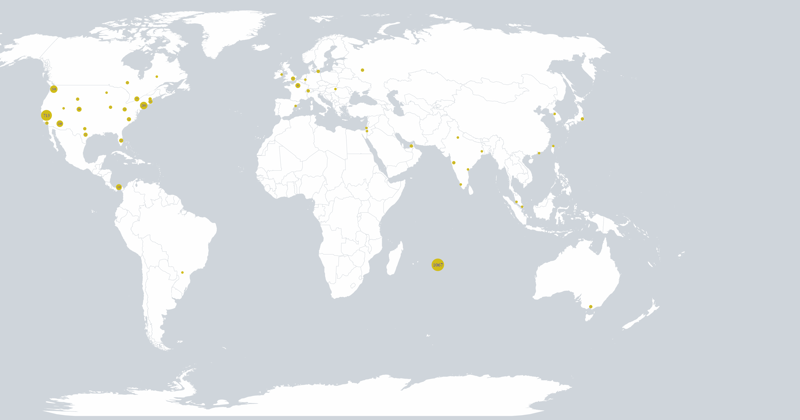
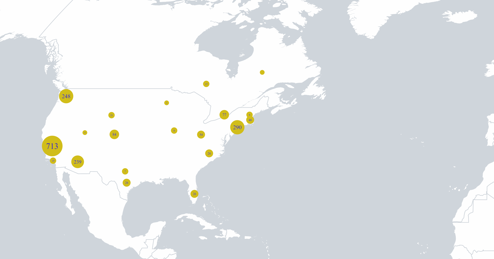
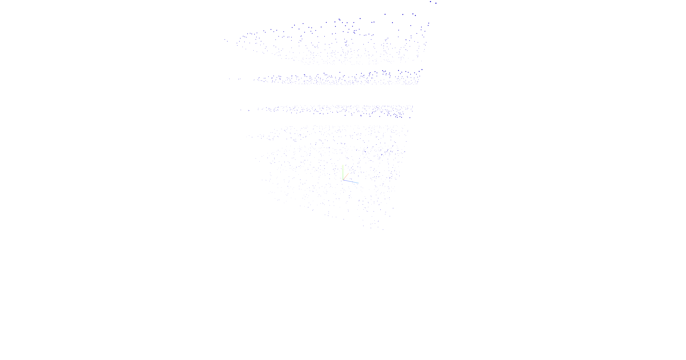
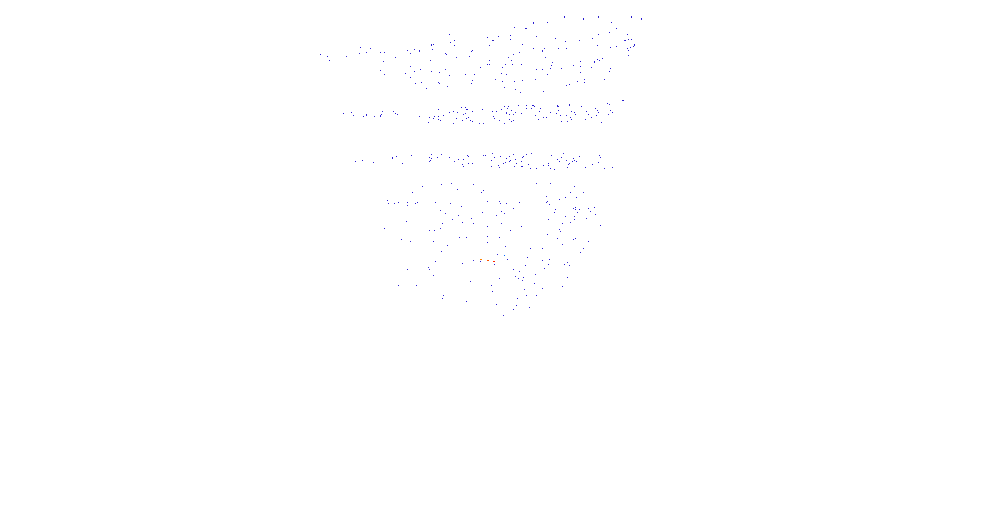

# Geographical experiment cookie domain owners (/map)

An experiment for my desertation at the master Information Design the Design Academy Eindhoven. Using a self made database, it maps the location of the registered owners that have placed 3rd party cookies (cross-domain) on my device.

# Spacial experiment creaing layers between cookies and their true origin (/stack)

A stack of planes in a 3d visual, as an attempt to see the ratio between the amount of cookies and the registered owners of domains that have placed these cookies.

